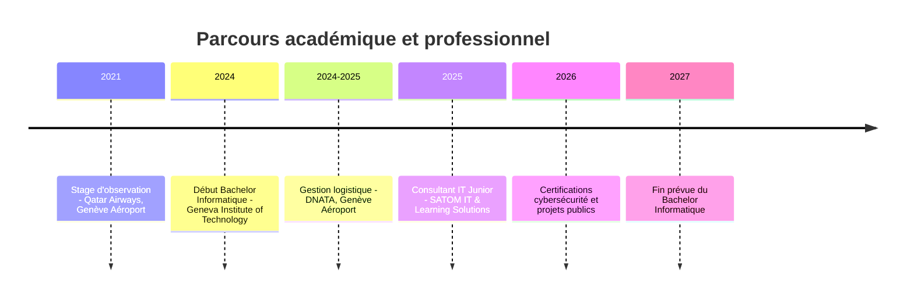

<div align="center">

<h1>Bilel Kaoulala</h1>

<p><b>Cybersécurité offensive · Pentest · Systèmes & Réseaux · Infrastructure</b></p>


<br/>
<br/>

<a href="https://bilelka.com"></a>
<a href="https://linkedin.com/in/bilel-kaoulala"></a>
<a href="mailto:bilel@mail.com"></a>

<br/>
<br/>


<br/>
<br/>

<a href="#profil">Profil</a> ·
<a href="#expertises">Expertises</a> ·
<a href="#realisations">Réalisations</a> ·
<a href="#stack">Stack</a> ·
<a href="#parcours">Parcours</a> ·
<a href="#objectifs">Objectifs</a> ·
<a href="#contact">Contact</a>

</div>

---

<a id="profil"></a>

## Bilel Kaoulala

**Étudiant en Informatique · Consultant IT Junior · Cybersécurité offensive & Infrastructure**

Passionné par la cybersécurité offensive, le pentest et l'analyse de vulnérabilités, je développe des projets techniques qui renforcent mes compétences en sécurité des systèmes, réseaux, applications et infrastructures.

Mon profil combine pratique technique, rigueur documentaire et curiosité terrain : comprendre l'environnement, cartographier les risques, tester proprement, corriger, puis rendre le résultat exploitable par une documentation claire.

```text
bilel@portfolio:~$ whoami

Formation      Bachelor Informatique @ Geneva Institute of Technology
Poste          Consultant IT Junior @ SATOM IT & Learning Solutions
Localisation   Pays de Gex, frontalier Genève
Mobilité       Suisse Romande · France frontalière · Remote
Objectif       Freelance en cybersécurité, infrastructure et web sécurisé
```

<table>
  <tr>
    <td><b>Orientation</b></td>
    <td>Cybersécurité offensive, pentest, analyse de vulnérabilités, hardening</td>
  </tr>
  <tr>
    <td><b>Socle technique</b></td>
    <td>Linux, réseaux, virtualisation, cloud, applications web, automatisation</td>
  </tr>
  <tr>
    <td><b>Approche</b></td>
    <td>Projets concrets, labs reproductibles, documentation claire, montée en compétence continue</td>
  </tr>
</table>

---

<a id="expertises"></a>

## Expertises

<table>
  <tr>
    <td width="50%">
      <h3>Audit & pentest</h3>
      <p>Analyse de vulnérabilités, reconnaissance, tests contrôlés, exploitation en lab, priorisation des risques et remédiation.</p>
    </td>
    <td width="50%">
      <h3>Systèmes & réseaux</h3>
      <p>Administration Linux, segmentation, VPN, pare-feu, supervision, logs, durcissement et haute disponibilité.</p>
    </td>
  </tr>
  <tr>
    <td width="50%">
      <h3>Infrastructure</h3>
      <p>Virtualisation Proxmox, stockage partagé, environnements de lab, Docker, monitoring et déploiements reproductibles.</p>
    </td>
    <td width="50%">
      <h3>Web sécurisé</h3>
      <p>Applications full-stack, APIs, authentification, paiement, validation des entrées et bonnes pratiques de sécurité applicative.</p>
    </td>
  </tr>
</table>

```text
Comprendre -> Cartographier -> Tester -> Sécuriser -> Automatiser -> Documenter
```

---

<a id="realisations"></a>

## Réalisations

<table>
  <tr>
    <td width="50%">
      <h3><a href="https://github.com/bilel-k/industritech">IndustriTech</a></h3>
      <p><b>Mars 2026</b></p>
      <p>Plateforme de supervision industrielle simulant 14 machines et 43 capteurs, avec dashboard temps réel, visualisation 3D et contrôles sécurité automatisés.</p>
      <p>
        
        
        
        
      </p>
    </td>
    <td width="50%">
      <h3><a href="https://github.com/bilel-k/audit-sec">Audit-Sec</a></h3>
      <p><b>Juin 2025</b></p>
      <p>Infrastructure de cybersécurité avec pare-feu, SIEM, scanner de vulnérabilités, VPN, IDS/IPS et remédiation post-audit.</p>
      <p>
        
        
        
        
      </p>
    </td>
  </tr>
  <tr>
    <td width="50%">
      <h3><a href="https://github.com/bilel-k/proxmox">Proxmox Cluster</a></h3>
      <p><b>Septembre 2025</b></p>
      <p>Plateforme de virtualisation multi-nœuds avec haute disponibilité, live migration, stockage NFS et gestion centralisée.</p>
      <p>
        
        
        
        
      </p>
    </td>
    <td width="50%">
      <h3><a href="https://github.com/bilel-k/fitcorner">FitCorner</a></h3>
      <p><b>Janvier 2026</b></p>
      <p>Site e-commerce fitness avec authentification JWT, catalogue produit, panier persistant et paiement Stripe.</p>
      <p>
        
        
        
        
      </p>
    </td>
  </tr>
</table>

---

<a id="stack"></a>

## Stack

<div align="center">


</div>

### Cybersécurité


### Infrastructure & supervision


<details>
<summary><b>Voir le détail des compétences</b></summary>

| Catégorie | Outils & notions |
|-----------|------------------|
| **Langages** | Python, TypeScript, JavaScript, Bash, C++, SQL |
| **Web** | React, Next.js, Node.js, Express.js, Tailwind CSS, APIs, authentification, Stripe |
| **Sécurité** | Pentest, analyse de vulnérabilités, Burp Suite, OWASP ZAP, Nessus, Nmap, Wireshark, Wazuh |
| **Systèmes** | Linux, hardening, logs, services, permissions, firewalling, VPN |
| **Infrastructure** | Proxmox, VMware, Docker, NFS, monitoring, cloud AWS/Azure |
| **Méthode** | Documentation, reporting, gestion de projet, HERMES/Agile, communication client |

</details>

---

<a id="parcours"></a>

## Parcours



| Période | Expérience |
|---------|------------|
| **2024 - 2027** | Bachelor en Informatique @ Geneva Institute of Technology |
| **Sep. 2025 - présent** | Consultant IT Junior @ SATOM IT & Learning Solutions · Freelance |
| **Nov. 2024 - Avr. 2025** | Gestion logistique @ DNATA · Genève Aéroport |
| **Jan. - Fév. 2021** | Stage d'observation @ Qatar Airways · Genève Aéroport |

---

## Certifications

| Certification | Organisme | Statut |
|---------------|-----------|--------|
| Fortinet Certified Fundamentals in Cybersecurity | Fortinet | Obtenue · Fév. 2026 · valide jusqu'en Fév. 2028 |
| Hacker Éthique | Cisco Networking Academy | Obtenue · Fév. 2026 |
| Introduction à la Cybersécurité | Cisco Networking Academy | Obtenue · Fév. 2026 |

**En préparation :** eJPT · CompTIA Security+ · OSCP

---

<a id="objectifs"></a>

## Objectifs

| Horizon | Direction |
|---------|-----------|
| **Court terme** | Renforcer mes bases offensives et défensives avec eJPT, CompTIA Security+ et une préparation OSCP structurée |
| **Court terme** | Construire une offre freelance orientée cybersécurité, infrastructure et développement web sécurisé en Suisse |
| **Moyen terme** | Rejoindre une équipe suisse sur des missions de sécurité, d'infrastructure ou de sécurité offensive |
| **Moyen terme** | Développer des projets numériques complémentaires pour progresser techniquement et gagner en autonomie |
| **Long terme** | Devenir consultant indépendant en cybersécurité et infrastructure |
| **Long terme** | Publier des outils open-source pour automatiser l'audit, le hardening ou la détection |
| **Long terme** | Poursuivre vers un Master orienté cybersécurité, cloud ou sécurité des systèmes |

---

## Activité GitHub

<div align="center">


<br/>
<br/>


<br/>
<br/>


<br/>
<br/>


<br/>
<br/>


</div>

---

<a id="contact"></a>

## Travaillons ensemble

Disponible pour échanger autour d'une opportunité, d'un projet ou d'une mission liée à la cybersécurité, l'infrastructure, les systèmes/réseaux ou le développement web sécurisé.

<div align="center">

<a href="https://bilelka.com"></a>
<a href="https://linkedin.com/in/bilel-kaoulala"></a>
<a href="mailto:bilel@mail.com"></a>

<br/>
<br/>

<sub>Cybersécurité offensive · Pentest · Infrastructure · Systèmes & Réseaux · Développement web sécurisé</sub>

</div>
